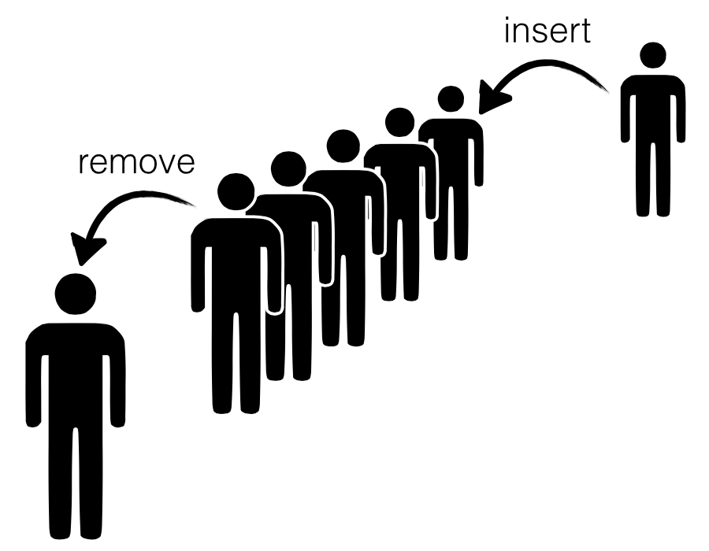
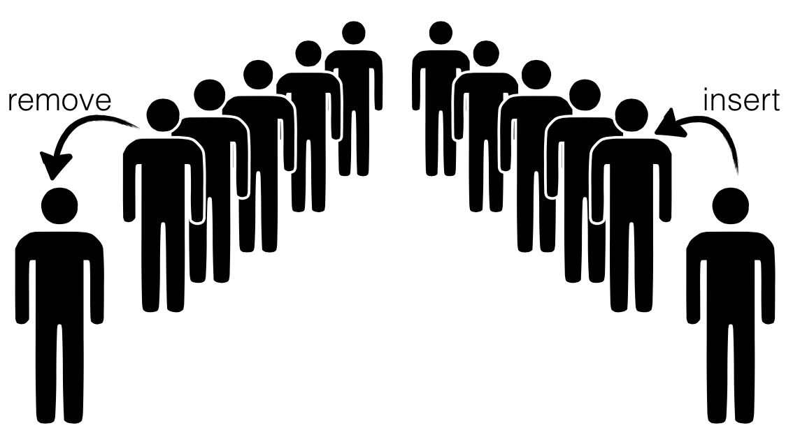

The "Hello World!" example for fancy type systems is probably the sized vector
or list `append` function ("The output has size equal to the *sum* of the
inputs!").  One the one hand, it is perfect: simple enough to explain without
pages of code, yet complex enough to show off whats cool about dependency. On
the other hand, like the sweater I'm sporting right now, it's a bit well-worn and
worse, was never wholly convincing ("Why do I *care* what the *size* of the
output list is anyway?")

Recently, I came across a nice example that is almost as simple, but is also
well motivated: Okasaki's beautiful [Lazy Amortized Queues][okasaki95].  This
structure leans heavily on an invariant to provide fast *insertion* and
*deletion*. Let's see how to enforce that invariant with LiquidHaskell.

<!-- more -->

<pre>30: {-@ LIQUID "--no-termination" @-}
31: {-@ LIQUID "--total"          @-}
32: {-@ LIQUID "--maxparams=3"    @-}
33: 
34: module LazyQueue (Queue, insert, remove, emp) where
35: 
36: import Prelude hiding (length)
37: 
38: -- | Size function actually returns the size: (Duh!)
39: 
40: {-@ size :: q:SList a -&gt; {v:Nat | v = size q} @-}
41: data Queue a = Q  { <a class=annot href="#">forall a. (LazyQueue.Queue a) -&gt; (LazyQueue.SList a)front</a> :: SList a
42:                   , <a class=annot href="#">forall a. (LazyQueue.Queue a) -&gt; (LazyQueue.SList a)back</a>  :: SList a
43:                   }
44: 
45: -- Source: Okasaki, JFP 1995
46: -- <a href="http://www.westpoint.edu/eecs/SiteAssets/SitePages/Faculty%20Publication%20Documents/Okasaki/jfp95queue.pdf">http://www.westpoint.edu/eecs/SiteAssets/SitePages/Faculty%20Publication%20Documents/Okasaki/jfp95queue.pdf</a>
47: 
</pre>

Queues 
------

A [queue][queue-wiki] is a structure into which we can `insert` and `remove` data
such that the order in which the data is removed is the same as the order in which
it was inserted.

To implement a queue *efficiently* one needs to have rapid access to both
the "head" as well as the "tail" because we `remove` elements from former
and `insert` elements into the latter. This is quite straightforward with
explicit pointers and mutation -- one uses an old school linked list and
maintains pointers to the head and the tail. But can we implement the
structure efficiently without having stoop so low?

Queues = Pair of Lists
----------------------

Almost two decades ago, Chris Okasaki came up with a very cunning way
to implement queues using a *pair* of lists -- let's call them `front`
and `back` which represent the corresponding parts of the Queue.

+ To `insert` elements, we just *cons* them onto the `back` list,
+ To `remove` elements, we just *un-cons* them from the `front` list.

The catch is that we need to shunt elements from the back to the
front every so often, e.g. when

1. a `remove` call is triggered, and
2. the `front` list is empty,

We can transfer the elements from the `back` to the `front`.

Okasaki observed that every element is only moved *once* from the
front to the back; hence, the time for `insert` and `lookup` could be
`O(1)` when *amortized* over all the operations. Awesome, right?!

Almost. Some set of unlucky `remove` calls (which occur when
the `front` is empty) are stuck paying the bill. They have a
rather high latency up to `O(n)` where `n` is the total number
of operations. Oops.

Queue = Balanced Lazy Lists
---------------------------

This is where Okasaki's beautiful insights kick in. Okasaki
observed that all we need to do is to enforce a simple invariant:

**Invariant:** Size of `front` >= Size of `back`

Now, if the lists are *lazy* i.e. only constructed as the head
value is demanded, then a single `remove` needs only a tiny `O(log n)`
in the worst case, and so no single `remove` is stuck paying the bill.

Let's see how to represent these Queues and ensure the crucial invariant(s)
with LiquidHaskell. What we need are the following ingredients:

1. A type for `List`s, and a way to track their `size`,

2. A type for `Queue`s which encodes the *balance* invariant -- ``front longer than back",

3. A way to implement the `insert`, `remove` and `transfer` operations.

Sized Lists
------------

The first part is super easy. Let's define a type:

<pre>127: data SList a = SL { <a class=annot href="#">forall a.
x1:(LazyQueue.SList a)
-&gt; {v : GHC.Types.Int | v == size x1 &amp;&amp; v &gt;= 0}size</a> :: Int, <a class=annot href="#">forall a. (LazyQueue.SList a) -&gt; [a]elems</a> :: [a]}
</pre>

We have a special field that saves the `size` because otherwise, we
have a linear time computation that wrecks Okasaki's careful
analysis. (Actually, he presents a variant which does *not* require
saving the size as well, but that's for another day.)

But how can we be sure that `size` is indeed the *real size* of `elems`?

Let's write a function to *measure* the real size:

<pre>140: {-@ measure realSize @-}
141: realSize      :: [a] -&gt; Int
142: <a class=annot href="#">forall a. x1:[a] -&gt; {VV : GHC.Types.Int | VV == realSize x1}realSize</a> []     = <a class=annot href="#">x1:GHC.Prim.Int# -&gt; {v : GHC.Types.Int | v == (x1  :  int)}0</a>
143: realSize (_:xs) = <a class=annot href="#">{v : GHC.Types.Int | v == (1  :  int)}1</a> <a class=annot href="#">x1:GHC.Types.Int
-&gt; x2:GHC.Types.Int -&gt; {v : GHC.Types.Int | v == x1 + x2}+</a> <a class=annot href="#">forall a. x1:[a] -&gt; {VV : GHC.Types.Int | VV == realSize x1}realSize</a> <a class=annot href="#">{v : [a] | v == xs &amp;&amp; len v &gt;= 0}xs</a>
</pre>

and now, we can simply specify a *refined* type for `SList` that ensures
that the *real* size is saved in the `size` field:

<pre>150: {-@ data SList a = SL {
151:        size  :: Nat 
152:      , elems :: {v:[a] | realSize v = size}
153:      }
154:   @-}
</pre>

As a sanity check, consider this:

<pre>160: <a class=annot href="#">{VV : (LazyQueue.SList {VV : [GHC.Types.Char] | len VV &gt;= 0}) | size VV &gt; 0}okList</a>  = <a class=annot href="#">x1:{v : GHC.Types.Int | v &gt;= 0}
-&gt; x2:{v : [{v : [GHC.Types.Char] | len v &gt;= 0}] | realSize v == x1}
-&gt; {v : (LazyQueue.SList {v : [GHC.Types.Char] | len v &gt;= 0}) | elems v == x2 &amp;&amp; size v == x1}SL</a> <a class=annot href="#">{v : GHC.Types.Int | v == (1  :  int)}1</a> <a class=annot href="#">{v : [{v : [GHC.Types.Char] | len v &gt;= 0}]&lt;\_ VV -&gt; false&gt; | null v &lt;=&gt; false &amp;&amp; len v &gt;= 0}[</a><a class=annot href="#">{v : [GHC.Types.Char] | len v &gt;= 0}"cat"</a>]    -- accepted
161: 
162: <a class=annot href="#">forall a. (LazyQueue.SList a)badList</a> = <a class=annot href="#">x1:{v : GHC.Types.Int | v &gt;= 0}
-&gt; x2:{v : [a] | realSize v == x1}
-&gt; {v : (LazyQueue.SList a) | elems v == x2 &amp;&amp; size v == x1}SL</a> <a class=annot href="#">{v : GHC.Types.Int | v == (1  :  int)}1</a> <a class=annot href="#">{v : [a] | null v &lt;=&gt; true &amp;&amp; realSize v == 0 &amp;&amp; len v == 0 &amp;&amp; len v &gt;= 0}[]</a>         -- rejected
</pre>

It is helpful to define a few aliases for `SList`s of a size `N` and
non-empty `SList`s:

<pre>169: -- | SList of size N
170: 
171: {-@ type SListN a N = {v:SList a | size v = N} @-}
172: 
173: -- | Non-Empty SLists:
174: 
175: {-@ type NEList a = {v:SList a | size v &gt; 0} @-}
176: 
</pre>

Finally, we can define a basic API for `SList`.

**To Construct** lists, we use `nil` and `cons`:

<pre>184: {-@ nil          :: SListN a 0  @-}
185: <a class=annot href="#">forall a. {v : (LazyQueue.SList a) | size v == 0}nil</a>              = <a class=annot href="#">x1:{v : GHC.Types.Int | v &gt;= 0}
-&gt; x2:{v : [a] | realSize v == x1}
-&gt; {v : (LazyQueue.SList a) | elems v == x2 &amp;&amp; size v == x1}SL</a> <a class=annot href="#">{v : GHC.Types.Int | v == (0  :  int)}0</a> <a class=annot href="#">{v : [a] | null v &lt;=&gt; true &amp;&amp; realSize v == 0 &amp;&amp; len v == 0 &amp;&amp; len v &gt;= 0}[]</a>
186: 
187: {-@ cons         :: a -&gt; xs:SList a -&gt; SListN a {size xs + 1}   @-}
188: <a class=annot href="#">forall a.
a
-&gt; x2:(LazyQueue.SList a)
-&gt; {v : (LazyQueue.SList a) | size v == size x2 + 1}cons</a> <a class=annot href="#">ax</a> (SL n xs) = <a class=annot href="#">x1:{v : GHC.Types.Int | v &gt;= 0}
-&gt; x2:{v : [a] | realSize v == x1}
-&gt; {v : (LazyQueue.SList a) | elems v == x2 &amp;&amp; size v == x1}SL</a> (<a class=annot href="#">{v : GHC.Types.Int | v == n &amp;&amp; v &gt;= 0}n</a><a class=annot href="#">x1:GHC.Types.Int
-&gt; x2:GHC.Types.Int -&gt; {v : GHC.Types.Int | v == x1 + x2}+</a><a class=annot href="#">{v : GHC.Types.Int | v == (1  :  int)}1</a>) (<a class=annot href="#">{VV : a | VV == x}x</a><a class=annot href="#">x1:a
-&gt; x2:[a]
-&gt; {v : [a] | null v &lt;=&gt; false &amp;&amp; xListSelector v == x1 &amp;&amp; realSize v == 1 + realSize x2 &amp;&amp; xsListSelector v == x2 &amp;&amp; len v == 1 + len x2}:</a><a class=annot href="#">{v : [a] | v == xs &amp;&amp; realSize v == n &amp;&amp; len v &gt;= 0}xs</a>)
</pre>

**To Destruct** lists, we have `hd` and `tl`.

<pre>194: {-@ tl           :: xs:NEList a -&gt; SListN a {size xs - 1}  @-}
195: <a class=annot href="#">forall a.
x1:{v : (LazyQueue.SList a) | size v &gt; 0}
-&gt; {v : (LazyQueue.SList a) | size v == size x1 - 1}tl</a> (SL n (_:xs)) = <a class=annot href="#">x1:{v : GHC.Types.Int | v &gt;= 0}
-&gt; x2:{v : [a] | realSize v == x1}
-&gt; {v : (LazyQueue.SList a) | elems v == x2 &amp;&amp; size v == x1}SL</a> (<a class=annot href="#">{v : GHC.Types.Int | v == n &amp;&amp; v &gt;= 0}n</a><a class=annot href="#">x1:GHC.Types.Int
-&gt; x2:GHC.Types.Int -&gt; {v : GHC.Types.Int | v == x1 - x2}-</a><a class=annot href="#">{v : GHC.Types.Int | v == (1  :  int)}1</a>) <a class=annot href="#">{v : [a] | v == xs &amp;&amp; len v &gt;= 0}xs</a>
196: 
197: {-@ hd           :: xs:NEList a -&gt; a @-}
198: <a class=annot href="#">forall a. {v : (LazyQueue.SList a) | size v &gt; 0} -&gt; ahd</a> (SL _ (x:_))  = <a class=annot href="#">{VV : a | VV == x}x</a> 
</pre>

Don't worry, they are perfectly *safe* as LiquidHaskell will make
sure we *only* call these operators on non-empty `SList`s. For example,

<pre>205: <a class=annot href="#">{v : [GHC.Types.Char] | len v &gt;= 0}okHd</a>  = <a class=annot href="#">{v : (LazyQueue.SList {v : [GHC.Types.Char] | len v &gt;= 0}) | size v &gt; 0}
-&gt; {v : [GHC.Types.Char] | len v &gt;= 0}hd</a> <a class=annot href="#">{v : (LazyQueue.SList {v : [GHC.Types.Char] | len v &gt;= 0}) | v == LazyQueue.okList &amp;&amp; size v &gt; 0}okList</a>       -- accepted
206: 
207: <a class=annot href="#">{VV : [GHC.Types.Char] | len VV &gt;= 0}badHd</a> = <a class=annot href="#">{v : (LazyQueue.SList {v : [GHC.Types.Char] | len v &gt;= 0}) | size v &gt; 0}
-&gt; {v : [GHC.Types.Char] | len v &gt;= 0}hd</a> (<a class=annot href="#">x1:{v : (LazyQueue.SList {v : [GHC.Types.Char] | len v &gt;= 0}) | size v &gt; 0}
-&gt; {v : (LazyQueue.SList {v : [GHC.Types.Char] | len v &gt;= 0}) | size v == size x1 - 1}tl</a> <a class=annot href="#">{v : (LazyQueue.SList {v : [GHC.Types.Char] | len v &gt;= 0}) | v == LazyQueue.okList &amp;&amp; size v &gt; 0}okList</a>)  -- rejected
</pre>

Queue Type
-----------

Now, it is quite straightforward to define the `Queue` type, as a pair of lists,
`front` and `back`, such that the latter is always smaller than the former:

<pre>218: {-@ data Queue a = Q {
219:        front :: SList a 
220:      , back  :: SListLE a (size front)
221:      }
222:   @-}
</pre>

Where the alias `SListLE a L` corresponds to lists with less than `N` elements:

<pre>228: {-@ type SListLE a N = {v:SList a | size v &lt;= N} @-}
</pre>

As a quick check, notice that we *cannot represent illegal Queues*:

<pre>234: <a class=annot href="#">{VV : (LazyQueue.Queue [GHC.Types.Char]) | 0 &lt; qsize VV}okQ</a>  = <a class=annot href="#">x1:(LazyQueue.SList [GHC.Types.Char])
-&gt; x2:{v : (LazyQueue.SList [GHC.Types.Char]) | size v &lt;= size x1}
-&gt; {v : (LazyQueue.Queue [GHC.Types.Char]) | qsize v == size x1 + size x2 &amp;&amp; front v == x1 &amp;&amp; back v == x2}Q</a> <a class=annot href="#">{v : (LazyQueue.SList {v : [GHC.Types.Char] | len v &gt;= 0}) | v == LazyQueue.okList &amp;&amp; size v &gt; 0}okList</a> <a class=annot href="#">{v : (LazyQueue.SList [GHC.Types.Char]) | size v == 0}nil</a>  -- accepted, |front| &gt; |back| 
235: 
236: <a class=annot href="#">{VV : (LazyQueue.Queue [GHC.Types.Char]) | 0 &lt; qsize VV}badQ</a> = <a class=annot href="#">x1:(LazyQueue.SList [GHC.Types.Char])
-&gt; x2:{v : (LazyQueue.SList [GHC.Types.Char]) | size v &lt;= size x1}
-&gt; {v : (LazyQueue.Queue [GHC.Types.Char]) | qsize v == size x1 + size x2 &amp;&amp; front v == x1 &amp;&amp; back v == x2}Q</a> <a class=annot href="#">{v : (LazyQueue.SList [GHC.Types.Char]) | size v == 0}nil</a> <a class=annot href="#">{v : (LazyQueue.SList {v : [GHC.Types.Char] | len v &gt;= 0}) | v == LazyQueue.okList &amp;&amp; size v &gt; 0}okList</a>  -- rejected, |front| &lt; |back|
</pre>

**To Measure Queue Size** let us define a function

<pre>242: {-@ measure qsize @-}
243: qsize         :: Queue a -&gt; Int
244: <a class=annot href="#">forall a.
x1:(LazyQueue.Queue a) -&gt; {VV : GHC.Types.Int | VV == qsize x1}qsize</a> (Q l r) = <a class=annot href="#">x1:(LazyQueue.SList a)
-&gt; {v : GHC.Types.Int | v == size x1 &amp;&amp; v &gt;= 0}size</a> <a class=annot href="#">{v : (LazyQueue.SList a) | v == l}l</a> <a class=annot href="#">x1:GHC.Types.Int
-&gt; x2:GHC.Types.Int -&gt; {v : GHC.Types.Int | v == x1 + x2}+</a> <a class=annot href="#">x1:(LazyQueue.SList a)
-&gt; {v : GHC.Types.Int | v == size x1 &amp;&amp; v &gt;= 0}size</a> <a class=annot href="#">{v : (LazyQueue.SList a) | v == r &amp;&amp; size v &lt;= size l}r</a>
</pre>

This will prove helpful to define `Queue`s of a given size `N` and
non-empty `Queue`s (from which values can be safely removed.)

<pre>251: {-@ type QueueN a N = {v:Queue a | N = qsize v} @-}
252: {-@ type NEQueue a  = {v:Queue a | 0 &lt; qsize v} @-}
</pre>

Queue Operations
----------------

Almost there! Now all that remains is to define the `Queue` API. The
code below is more or less identical to Okasaki's (I prefer `front`
and `back` to his `left` and `right`.)

**The Empty Queue** is simply one where both `front` and `back` are `nil`.

<pre>267: {-@ emp :: QueueN a 0 @-}
268: <a class=annot href="#">forall a. {v : (LazyQueue.Queue a) | 0 == qsize v}emp</a> = <a class=annot href="#">x1:(LazyQueue.SList a)
-&gt; x2:{v : (LazyQueue.SList a) | size v &lt;= size x1}
-&gt; {v : (LazyQueue.Queue a) | qsize v == size x1 + size x2 &amp;&amp; front v == x1 &amp;&amp; back v == x2}Q</a> <a class=annot href="#">{v : (LazyQueue.SList a) | size v == 0}nil</a> <a class=annot href="#">{v : (LazyQueue.SList a) | size v == 0}nil</a>
</pre>

**To Insert** an element we just `cons` it to the `back` list, and call
the *smart constructor* `makeq` to ensure that the balance invariant holds:

<pre>275: {-@ insert       :: a -&gt; q:Queue a -&gt; QueueN a {qsize q + 1}   @-}
276: <a class=annot href="#">forall a.
a
-&gt; x2:(LazyQueue.Queue a)
-&gt; {v : (LazyQueue.Queue a) | qsize x2 + 1 == qsize v}insert</a> <a class=annot href="#">ae</a> (Q f b) = <a class=annot href="#">x1:(LazyQueue.SList a)
-&gt; x2:{v : (LazyQueue.SList a) | size v &lt;= size x1 + 1}
-&gt; {v : (LazyQueue.Queue a) | size x1 + size v == qsize v}makeq</a> <a class=annot href="#">{v : (LazyQueue.SList a) | v == f}f</a> (<a class=annot href="#">{VV : a | VV == e}e</a> <a class=annot href="#">a
-&gt; x2:(LazyQueue.SList a)
-&gt; {v : (LazyQueue.SList a) | size v == size v + 1}`cons`</a> <a class=annot href="#">{v : (LazyQueue.SList a) | v == b &amp;&amp; size v &lt;= size f}b</a>)
</pre>

**To Remove** an element we pop it off the `front` by using `hd` and `tl`.
Notice that the `remove` is only called on non-empty `Queue`s, which together
with the key balance invariant, ensures that the calls to `hd` and `tl` are safe.

<pre>284: {-@ remove       :: q:NEQueue a -&gt; (a, QueueN a {qsize q - 1}) @-}
285: <a class=annot href="#">forall a.
x1:{v : (LazyQueue.Queue a) | 0 &lt; qsize v}
-&gt; (a, {v : (LazyQueue.Queue a) | qsize x1 - 1 == qsize v})remove</a> (Q f b)   = <a class=annot href="#">forall a b &lt;p2 :: a b -&gt; Prop&gt;.
x1:a
-&gt; x2:{VV : b&lt;p2 x1&gt; | true}
-&gt; {v : (a, b)&lt;\x6 VV -&gt; p2 x6&gt; | fst v == x1 &amp;&amp; x_Tuple22 v == x2 &amp;&amp; snd v == x2 &amp;&amp; x_Tuple21 v == x1}(</a><a class=annot href="#">{v : (LazyQueue.SList a) | size v &gt; 0} -&gt; ahd</a> <a class=annot href="#">{v : (LazyQueue.SList a) | v == f}f</a>, <a class=annot href="#">x1:(LazyQueue.SList a)
-&gt; x2:{v : (LazyQueue.SList a) | size v &lt;= size x1 + 1}
-&gt; {v : (LazyQueue.Queue a) | size x1 + size v == qsize v}makeq</a> (<a class=annot href="#">x1:{v : (LazyQueue.SList a) | size v &gt; 0}
-&gt; {v : (LazyQueue.SList a) | size v == size x1 - 1}tl</a> <a class=annot href="#">{v : (LazyQueue.SList a) | v == f}f</a>) <a class=annot href="#">{v : (LazyQueue.SList a) | v == b &amp;&amp; size v &lt;= size f}b</a>)
</pre>

*Aside:* Why didn't we (or Okasaki) use a pattern match here?

**To Ensure the Invariant** we use the smart constructor `makeq`,
which is where the heavy lifting, such as it is, happens. The
constructor takes two lists, the front `f` and back `b` and if they
are balanced, directly returns the `Queue`, and otherwise transfers
the elements from `b` over using `rot`ate.

<pre>297: {-@ makeq :: f:SList a
298:           -&gt; b:SListLE a {size f + 1 }
299:           -&gt; QueueN a {size f + size b}
300:   @-}
301: <a class=annot href="#">forall a.
x1:(LazyQueue.SList a)
-&gt; x2:{v : (LazyQueue.SList a) | size v &lt;= size x1 + 1}
-&gt; {v : (LazyQueue.Queue a) | size x1 + size x2 == qsize v}makeq</a> <a class=annot href="#">(LazyQueue.SList a)f</a> <a class=annot href="#">{v : (LazyQueue.SList a) | size v &lt;= size f + 1}b</a> 
302:   | <a class=annot href="#">x1:(LazyQueue.SList a)
-&gt; {v : GHC.Types.Int | v == size x1 &amp;&amp; v &gt;= 0}size</a> <a class=annot href="#">{v : (LazyQueue.SList a) | v == b &amp;&amp; size v &lt;= size f + 1}b</a> <a class=annot href="#">x1:GHC.Types.Int
-&gt; x2:GHC.Types.Int -&gt; {v : GHC.Types.Bool | Prop v &lt;=&gt; x1 &lt;= v}&lt;=</a> <a class=annot href="#">x1:(LazyQueue.SList a)
-&gt; {v : GHC.Types.Int | v == size x1 &amp;&amp; v &gt;= 0}size</a> <a class=annot href="#">{v : (LazyQueue.SList a) | v == f}f</a> = <a class=annot href="#">x1:(LazyQueue.SList a)
-&gt; x2:{v : (LazyQueue.SList a) | size v &lt;= size x1}
-&gt; {v : (LazyQueue.Queue a) | qsize v == size x1 + size x2 &amp;&amp; front v == x1 &amp;&amp; back v == x2}Q</a> <a class=annot href="#">{v : (LazyQueue.SList a) | v == f}f</a> <a class=annot href="#">{v : (LazyQueue.SList a) | v == b &amp;&amp; size v &lt;= size f + 1}b</a>
303:   | otherwise        = <a class=annot href="#">x1:(LazyQueue.SList a)
-&gt; x2:{v : (LazyQueue.SList a) | size v &lt;= size x1}
-&gt; {v : (LazyQueue.Queue a) | qsize v == size x1 + size x2 &amp;&amp; front v == x1 &amp;&amp; back v == x2}Q</a> (<a class=annot href="#">forall a.
x1:(LazyQueue.SList a)
-&gt; x2:{v : (LazyQueue.SList a) | size v == 1 + size x1}
-&gt; x3:(LazyQueue.SList a)
-&gt; {v : (LazyQueue.SList a) | size v == size x1 + size x2 + size x3}rot</a> <a class=annot href="#">{v : (LazyQueue.SList a) | v == f}f</a> <a class=annot href="#">{v : (LazyQueue.SList a) | v == b &amp;&amp; size v &lt;= size f + 1}b</a> <a class=annot href="#">{v : (LazyQueue.SList a) | size v == 0}nil</a>) <a class=annot href="#">{v : (LazyQueue.SList a) | size v == 0}nil</a>
</pre>

**The Rotate** function is only called when the `back` is one larger
than the `front` (we never let things drift beyond that). It is
arranged so that it the `hd` is built up fast, before the entire
computation finishes; which, combined with laziness provides the
efficient worst-case guarantee.

<pre>313: {-@ rot :: f:SList a
314:         -&gt; b:SListN _ {1 + size f}
315:         -&gt; a:SList _
316:         -&gt; SListN _ {size f + size b + size a}
317:   @-}
318: <a class=annot href="#">forall a.
x1:(LazyQueue.SList a)
-&gt; x2:{v : (LazyQueue.SList a) | size v == 1 + size x1}
-&gt; x3:(LazyQueue.SList a)
-&gt; {v : (LazyQueue.SList a) | size v == size x1 + size x2 + size x3}rot</a> <a class=annot href="#">(LazyQueue.SList a)f</a> <a class=annot href="#">{v : (LazyQueue.SList a) | size v == 1 + size f}b</a> <a class=annot href="#">(LazyQueue.SList a)a</a>
319:   | <a class=annot href="#">x1:(LazyQueue.SList a)
-&gt; {v : GHC.Types.Int | v == size x1 &amp;&amp; v &gt;= 0}size</a> <a class=annot href="#">{v : (LazyQueue.SList a) | v == f}f</a> <a class=annot href="#">x1:GHC.Types.Int
-&gt; x2:GHC.Types.Int -&gt; {v : GHC.Types.Bool | Prop v &lt;=&gt; x1 == v}==</a> <a class=annot href="#">{v : GHC.Types.Int | v == (0  :  int)}0</a> = <a class=annot href="#">{v : (LazyQueue.SList a) | size v &gt; 0} -&gt; ahd</a> <a class=annot href="#">{v : (LazyQueue.SList a) | v == b &amp;&amp; size v == 1 + size f}b</a> <a class=annot href="#">a
-&gt; x2:(LazyQueue.SList a)
-&gt; {v : (LazyQueue.SList a) | size v == size v + 1}`cons`</a> <a class=annot href="#">{v : (LazyQueue.SList a) | v == a}a</a>
320:   | otherwise   = <a class=annot href="#">{v : (LazyQueue.SList a) | size v &gt; 0} -&gt; ahd</a> <a class=annot href="#">{v : (LazyQueue.SList a) | v == f}f</a> <a class=annot href="#">a
-&gt; x2:(LazyQueue.SList a)
-&gt; {v : (LazyQueue.SList a) | size v == size v + 1}`cons`</a> <a class=annot href="#">forall a.
x1:(LazyQueue.SList a)
-&gt; x2:{v : (LazyQueue.SList a) | size v == 1 + size x1}
-&gt; x3:(LazyQueue.SList a)
-&gt; {v : (LazyQueue.SList a) | size v == size x1 + size x2 + size x3}rot</a> (<a class=annot href="#">x1:{v : (LazyQueue.SList a) | size v &gt; 0}
-&gt; {v : (LazyQueue.SList a) | size v == size x1 - 1}tl</a> <a class=annot href="#">{v : (LazyQueue.SList a) | v == f}f</a>) (<a class=annot href="#">x1:{v : (LazyQueue.SList a) | size v &gt; 0}
-&gt; {v : (LazyQueue.SList a) | size v == size x1 - 1}tl</a> <a class=annot href="#">{v : (LazyQueue.SList a) | v == b &amp;&amp; size v == 1 + size f}b</a>) (<a class=annot href="#">{v : (LazyQueue.SList a) | size v &gt; 0} -&gt; ahd</a> <a class=annot href="#">{v : (LazyQueue.SList a) | v == b &amp;&amp; size v == 1 + size f}b</a> <a class=annot href="#">a
-&gt; x2:(LazyQueue.SList a)
-&gt; {v : (LazyQueue.SList a) | size v == size v + 1}`cons`</a> <a class=annot href="#">{v : (LazyQueue.SList a) | v == a}a</a>)
</pre>

Conclusion
----------

Well there you have it; Okasaki's beautiful lazy Queue, with the
invariants easily expressed and checked with LiquidHaskell. I find
this example particularly interesting because the refinements express
invariants that are critical for efficiency, and furthermore the code
introspects on the `size` in order to guarantee the invariants.  Plus,
it's just marginally more complicated than `append` and so, (I hope!)
was easy to follow.

[okasaki95]: http://www.westpoint.edu/eecs/SiteAssets/SitePages/Faculty%20Publication%20Documents/Okasaki/jfp95queue.pdf

[queue-wiki]: http://en.wikipedia.org/wiki/Queue_%28abstract_data_type%29
