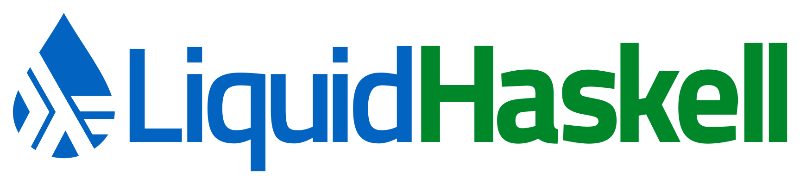

LiquidHaskell _(LH)_ refines Haskell's types with logical predicates that let you enforce important properties at compile time.

# Guarantee Functions are Total

LH warns you that head is not total as it is missing the case for <code>[]</code> and checks that it is total on <code>NonEmpty</code> lists.
<a href="blogposts/2013-01-31-safely-catching-a-list-by-its-tail.lhs">(more...)</a>

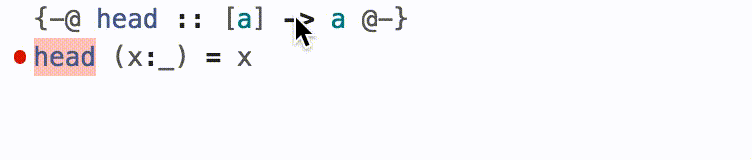

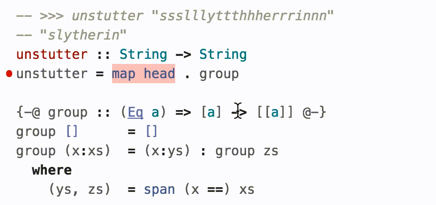

The input contract propagates to uses of <code>head</code> which are verified by ensuring the arguments are <code>NonEmpty</code>. 

# Keep Pointers Within Bounds

LH lets you avoid off-by-one errors that can lead to crashes or buffer overflows.
<a href="blogposts/2013-03-04-bounding-vectors.lhs">(more...)</a>

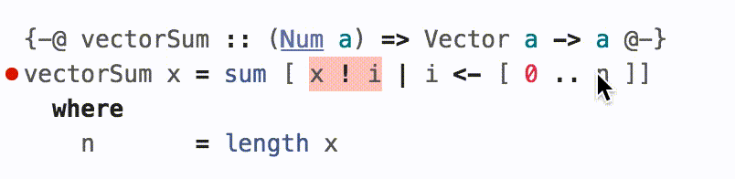

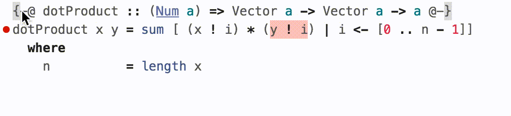

Dependent contracts let you specify, e.g. that <code>dotProduct</code> requires equal-sized vectors.

# Avoid Infinite Loops

LH checks that functions terminate and so warns about the infinite recursion due to the missing case in <code>fib</code>.
<a href="tags.html#termination">(more...)</a>

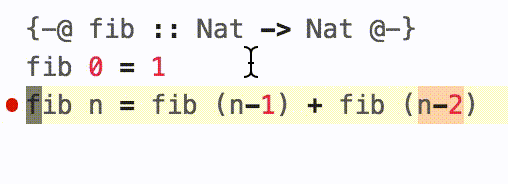

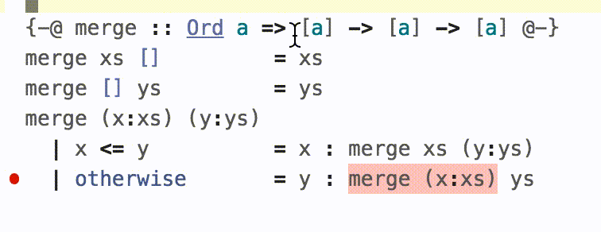

<em>Metrics</em> let you check that recursive functions over complex data types terminate. 

# Enforce Correctness Properties

Write correctness requirements, for example a list is ordered, as refinements. LH makes illegal values be <em>unrepresentable</em>.
<a href="blogposts/2013-07-29-putting-things-in-order.lhs">(more...)</a>

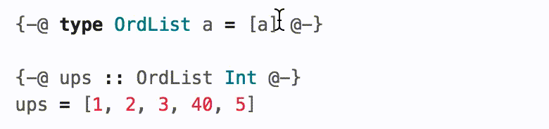

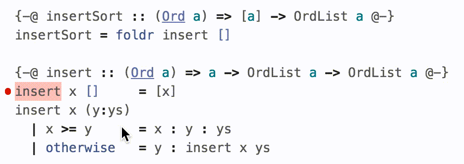

LH automatically points out logic bugs, and proves that functions return correct outputs <em>for all inputs</em>. 

# Prove Laws by Writing Code

Specify <em>laws</em>, e.g. that the append function <code>++</code> is associative, as Haskell functions. 

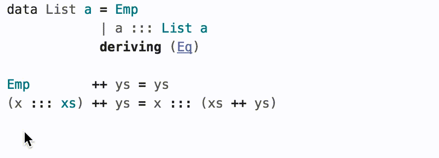

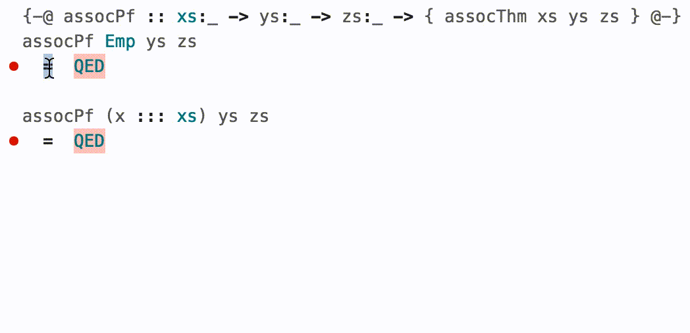

Verify laws via <em>equational proofs</em> that are plain Haskell functions. Induction is simply recursion, and case-splitting is just pattern-matching. 

# Get Started

The easiest way to try LiquidHaskell is [online, in your browser](http://goto.ucsd.edu:8090/index.html). This environment is ideal for quick experiments or following one of the tutorials:

* The [Official Tutorial](https://ucsd-progsys.github.io/intro-refinement-types/120/) (long but complete) (has interactive exercises)
* [Andres Loeh's Tutorial](https://liquid.kosmikus.org) (concise but incomplete)

For links to more documentation, see the nav-bar at the top of this page.

# Get Involved

If you are interested in contributing to LH and its ecosystem, that's great!
We have more information on our [GitHub repository](https://github.com/ucsd-progsys/liquidhaskell).
